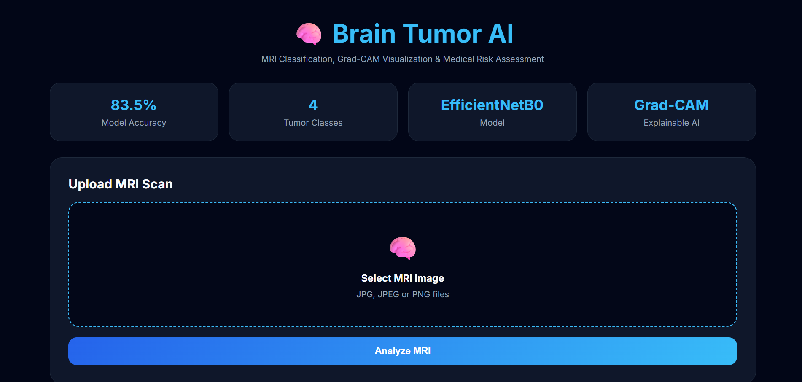
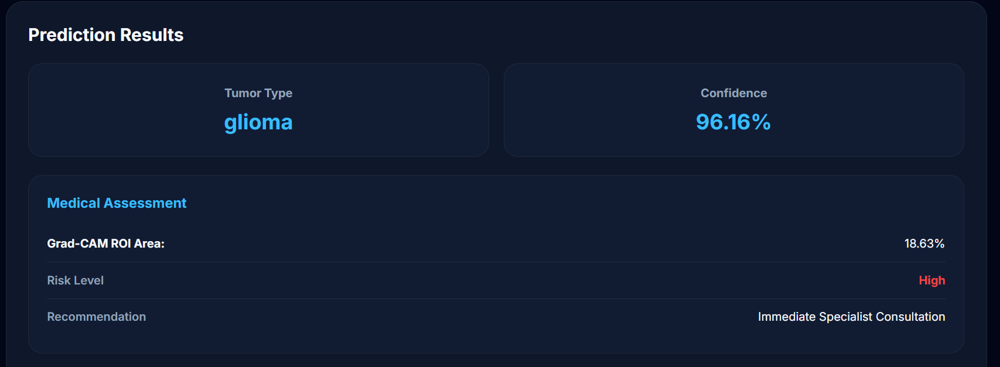
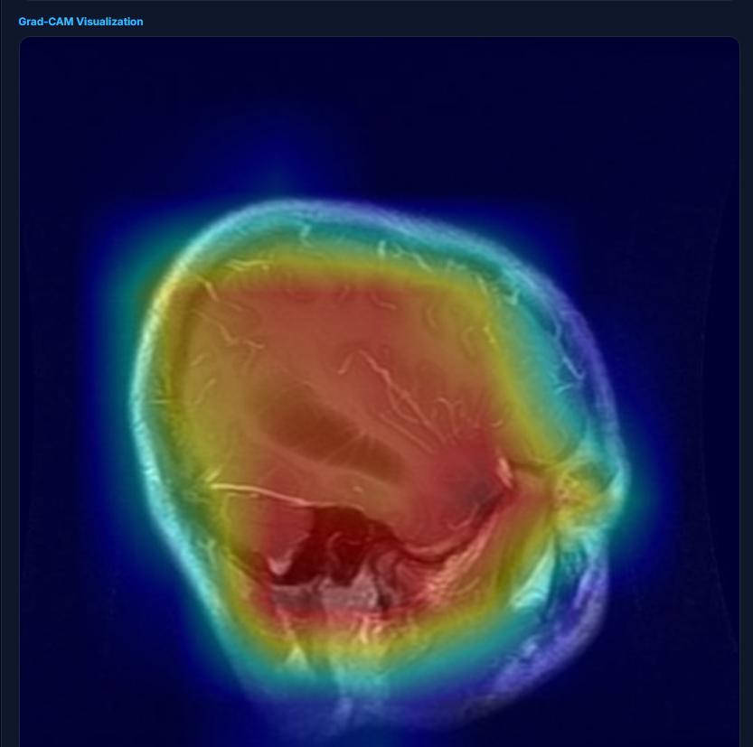
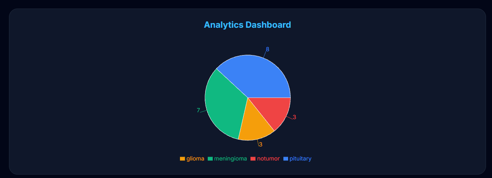
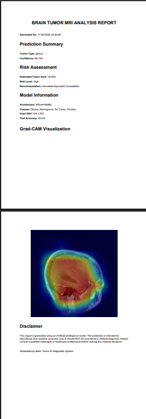

# 🧠 Brain Tumor Classification Using EfficientNetB0

An AI-powered Brain Tumor MRI Classification System built using TensorFlow, Flask, and React.

The system classifies MRI scans into:

* Glioma
* Meningioma
* Pituitary Tumor
* No Tumor

It also provides:

* Grad-CAM Explainability
* Risk Assessment
* Tumor Information
* Survival Rate Information
* Operation Possibility Assessment
* PDF Report Generation
* Prediction History
* Analytics Dashboard

---

## 🚀 Features

### MRI Classification

Upload a brain MRI image and get instant prediction.

### Explainable AI

Grad-CAM highlights image regions responsible for prediction.

### Risk Analysis

Provides:

* Estimated ROI Area
* Risk Level
* Medical Recommendation

### Tumor Information

Displays:

* Description
* Survival Rate
* Treatment
* Recommended Specialist
* Operation Possibility

### Analytics Dashboard

* Prediction History
* Pie Chart Analytics

### PDF Report

Download a detailed medical analysis report.

---


## 📸 Screenshots

### 🏠 Home Page



---

### 🔍 MRI Prediction



---

### 🧠 Grad-CAM Visualization



---

### 📊 Analytics Dashboard



---

### 📄 PDF Report



---
## 🛠 Tech Stack

### AI / ML

* TensorFlow
* Keras
* EfficientNetB0
* NumPy
* OpenCV

### Backend

* Flask
* Flask-CORS

### Frontend

* React
* Vite
* Axios
* Recharts

### Report Generation

* ReportLab

---

## 📊 Model Performance

| Metric   | Value          |
| -------- | -------------- |
| Accuracy | 83.5%          |
| Classes  | 4              |
| Model    | EfficientNetB0 |

---

## 📁 Project Structure

```text
BrainTumorAI/
│
├── backend/
├── frontend/
├── notebooks/
├── models/
├── README.md
└── .gitignore
```

---

## ⚙️ Installation

### Backend

```bash
cd backend

pip install -r requirements.txt

python app.py
```

### Frontend

```bash
cd frontend

npm install

npm run dev
```

---

## 👨‍💻 Team Members

* Dipan Pramanik
* Tanay Dey
* Sandip Hait
* Swagatam Bag
* Shyamal Kumar Mahanti


---

## 🔮 Future Scope

* U-Net Tumor Segmentation
* Real Hospital MRI Dataset
* Cloud Deployment
* Doctor Appointment Integration
* Multi-modal Medical Records

---
